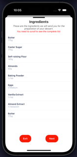
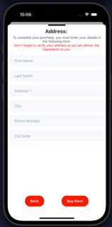
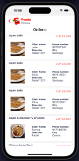

# Pronto Postres

Pronto Postres es una aplicación móvil de comercio electrónico para la venta de ingredientes utilizados en la preparación de postres. Esta aplicación está construida con React Native y ofrece una experiencia intuitiva para los amantes de la repostería.

## Funcionalidades principales

- **Login**: Los usuarios pueden iniciar sesión en la aplicación para acceder a sus perfiles y realizar compras.
- **Detalle de Postres**: Los usuarios pueden ver detalles sobre cómo preparar cada postre, incluyendo ingredientes necesarios y pasos de preparación.
- **Compra de Ingredientes**: Los usuarios tienen la capacidad de comprar los ingredientes necesarios para los postres directamente desde la aplicación.
- **Visualización de Pedidos**: Los usuarios pueden ver el historial de sus pedidos anteriores.

## Tecnologías utilizadas

- **React Native**: Plataforma de desarrollo móvil para la creación de aplicaciones móviles nativas.
- **UI Kitten**: Biblioteca de componentes de interfaz de usuario de React Native para un diseño elegante y moderno.
- **Redux Toolkit y Thunks**: Para el manejo del estado de la aplicación y las peticiones asíncronas.
- **Axios**: Cliente HTTP para realizar peticiones a la API del servidor.
- **Formik y Yup**: Para la gestión de formularios y la validación de datos.

## Instalación y Ejecución

1. **Clona el repositorio:**

2. **Ejecuta npm install para que se instalen todas las dependencias.**

3. **Ejecuta Npm start en tu terminal e ingresa el "I" para ejecutar en ios y "A" android**

4. **Una vez ejecutado y abierta la app, podrás ingresar SOLO con los siguientes usuarios**
   Usuario 1
      Usuario: Christian Muñoz
      Email: cmunozp@copec.cl
      Contraseña: abc1234
   Usuario 2 
      Usuario: Elías Musalem
      Email: emusalem@copec.cl
      Contraseña: abc1234
   Usuario 3
      Usuario: María Mandujano
      Email: mmandujano@copec.cl
      Contraseña: abc1234
